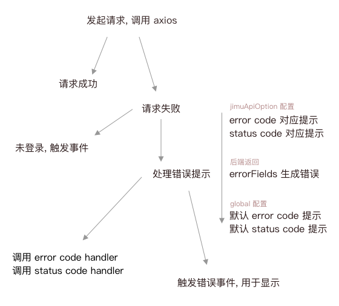

## API Base

> 公司项目 API 前端复用逻辑

包含功能:

- 提供 API 调用简写语法,
- 提供页面顶部显示的进度条,
- 生成 API 报错信息(供外部的 UI 组件展示).



注意事项

原先耦合的代码需要手动处理一遍, 搜则对应的逻辑会丢失:

- 监听 `EJimuApiEvent.ErrorUnauthorized` 事件, 调用 `clearUserInfoCache()`,
- 监听 `EJimuApiEvent.ErrorMessage` 事件, 调用 `message.error(errorHumanized)`,
- 监听 `EJimuApiEvent.ErrorGotoSignin` 调用 `gotoSignin(signinPath, location.href)`.

### Usages


```bash
yarn add @jimengio/api-base
```

```tsx
import { get } from "@jimengio/api-base";

get({
  baseURL: `http://my-api/api`,
  url: `/info`,
});

// 发送其他方法
get({
  method: "POST",
  baseURL: `http://my-api/api`,
  url: `/info`,
});
```

##### 注册错误信息

```tsx
import { addGlobalErrorMessages } from "@jimengio/api-base";

addGlobalErrorMessages({
  00001: "信息不合法",
});
```

对于特定的错误码定制错误信息(覆盖默认注册的错误信息):

```ts
put({
  url: `/plants/${plantId}/materials/${materialId}`,
  baseURL: coresBaseUrl,
  data: options,
  errorMessage: {
    [ApiErrorCode.DBDup]: lingual.materialCodeAlreadyExists,
  },
});
```

通过 `false` 可以关闭特定错误码的报错提示:

```ts
{
  errorMessage: {
    [ApiErrorCode.DBDup]: false,
  },
}
```

通过 axios 的 `paramsSerializer` 的参数可以对数组格式的 query 参数进行格式化:

```js
{
  paramsSerializer: (params) => Qs.stringify(params, {arrayFormat: 'brackets'}),
}
```

##### 监听 API 特殊的事件:

```tsx
import { EJimuApiEvent } from "@jimengio/api-base";

JimuApisEventBus.on(EJimuApiEvent.ErrorMessage, (error: string) => {
  console.error(error);
});
```

##### 修改默认多语言

```tsx
export { changeApisLingual, EApisLangKind } from "@jimengio/api-base";

changeApisLingual(EApisLangKind.enUS);
```

##### 页面顶部显示进度条

展示网络加载进度(不精确):

```tsx
import { NetProgress } from "@jimengio/api-base";

<NetProgress />;
```

### API

- `get` `post` `put` `del` `patch`, 基础 HTTP 请求
- `changeApisLingual`, `EApisLangKind` 用于修改多语言配置
- `NetProgress` 渲染网络状态的组件
- `addGlobalErrorMessages` `addGlobalStatusCodeErrorMessages` 设置错误文案`
- `ApiError` `IJimuApiOption` API 属性配置类型
- `BuiltinApiErrorCode` 内置错误码, 偶尔会用到
- 私有 `generateCancelToken` `getApiBaseUrl` `setApiBaseUrl` `setApiDefaultHeader` API 状态修改方法
- 私有 `globalErrorMessages` `globalStatusCodeErrorMessages`(类型为 `IErrorMessages`) 读取全局错误文案配置
- 私有 `showError` 触发错误
